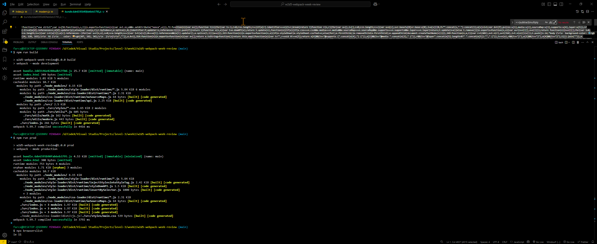

Packages:

- `@babel/core`
- `@babel/preset-env`
- `babel-loader`
- `css-loader`
- `style-loader`
- `html-webpack-plugin`
- `webpack`
- `webpack-cli`


Key config lines:

```json
plugins: [htmlWebpack = new HtmlWebpackPlugin({ template: "./index.html" })],
entry: "./src/index.js",
output: { filename: "bundle.[contenthash].js", path: resolve(__dirname, "dist"), clean: true, },
module: { rules: [{ test: /\.css$/, use: ["style-loader", "css-loader"] }, { test: /\.(?:js|mjs|cjs)$/, loader: "babel-loader", exclude: /node_modules/, }]}
```